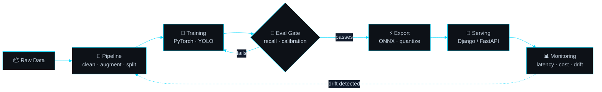

<div align="center">


<a href="https://www.linkedin.com/in/rdiegosilva"></a>
<a href="mailto:diegodg22@outlook.com"></a>
<a href="https://yinvictus1.github.io/Curriculum/"></a>

</div>

<br/>

```console
diego@ai-engineer:~$ whoami --verbose

  role         AI Engineer · Computer Vision & LLM Systems
  location     Rio de Janeiro, Brazil  (UTC-3, full US overlap)
  degree       Systems Analysis & Development — graduating late 2026
  owns         data pipeline → model → API → deployment → monitoring
  cares about  latency, inference cost, failure handling
  status       open to remote roles ▉
```

I build machine learning systems that **run end to end** — not notebooks. Most of my work lives where a model stops being an experiment and starts being a service somebody depends on.

---

## 🧬 How I Ship a Model



---

## 🚀 Selected Work

<table>
<tr>
<td width="50%" valign="top">

### 🦷 CárieScan AI
`computer vision` `healthcare`

Detects dental caries in X-rays and intraoral photos, built to run inside a real clinic workflow.

  

<details>
<summary><b>⚙️ The hard part</b></summary>
<br/>
Clinic hardware is modest, so inference had to be fast without trading away recall on small lesions. ONNX export plus quantization brought latency down while keeping detection quality on the cases that matter clinically.
</details>

</td>
<td width="50%" valign="top">

### 🩻 Chest X-Ray Anomaly Detection
`deep learning` `medical imaging`

Pipeline for detecting pulmonary anomalies in chest radiographs.

  

<details>
<summary><b>⚙️ The hard part</b></summary>
<br/>
Heavy class imbalance makes accuracy actively misleading — a model predicting "normal" every time scores well and helps nobody. Built an evaluation protocol around the metrics that reflect clinical usefulness instead.
</details>

</td>
</tr>
<tr>
<td width="50%" valign="top">

### 📉 DropoutRisk `in progress`
`predictive modeling` `education`

Risk scoring that flags students likely to drop out while there's still time to intervene.

 

<details>
<summary><b>⚙️ The hard part</b></summary>
<br/>
A raw score is useless to a coordinator. The model outputs calibrated probabilities, and the decision threshold is chosen against the real cost tradeoff between missing a student and wasting an intervention.
</details>

</td>
<td width="50%" valign="top">

### 🎥 TrackFlow
`object tracking` `operational analytics`

Multi-object tracking and counting of people and vehicles from video streams.

 

<details>
<summary><b>⚙️ The hard part</b></summary>
<br/>
Identity has to survive occlusion. If a tracker reassigns IDs when objects cross, counting error compounds over a long session until the number is worthless.
</details>

</td>
</tr>
</table>

<div align="center">

**📝 Examina** — production Django platform for exam simulations, running inside an academic institution
 

</div>

---

## 🛠️ Stack

<div align="center">
<table>
<tr>
<td align="center" width="25%">

**Vision & ML**


`YOLO` `ONNX`
`scikit-learn`

</td>
<td align="center" width="25%">

**LLM & MLOps**


`RAG` `evals`
`monitoring`

</td>
<td align="center" width="25%">

**Backend & Data**


`REST APIs`
`pandas` `NumPy`

</td>
<td align="center" width="25%">

**Cloud** *(building on)*


`AI Foundry`
`Azure OpenAI`

</td>
</tr>
</table>
</div>

---

## 📊 Activity

<div align="center">


</div>

---

<div align="center">

## 📫 Let's talk

Always up for a conversation about computer vision, LLM systems, or a hard production problem.

<a href="mailto:diegodg22@outlook.com"></a>
<a href="https://www.linkedin.com/in/rdiegosilva"></a>

<br/><br/>


</div>